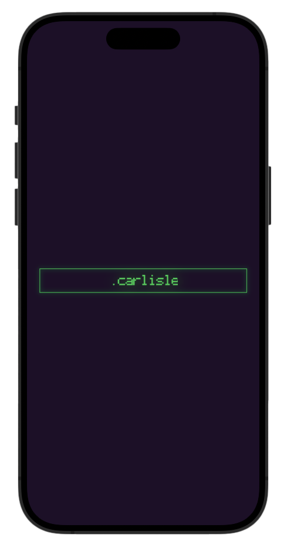

# .carlisle

An extremely lightweight UI, built to comsume OpenAI's Assistant API's

## Description

With a minimilist, cyber-punk theme taken straight from the 80's, this lightweight application is perfect for interacting with your personal assistant.

## Getting Started

### Dependencies

* Swift 5 + SwiftUI, in Xcode.
* iPhone

* You'll need your own OpenAI API key and to have already created an AI Assistant. Creating the Assistant can be done either through OpenAI's developer UI, or through their endpoint.

### Installing

Must be built onto personal iPhone, using Xcode.

### Executing program

* Runs as iPhone application.

## Authors

Chris Brannon

## Version History

* 0.1
    * First Release

## License

OpenSource, feel free to fork, or contribute to this project.

